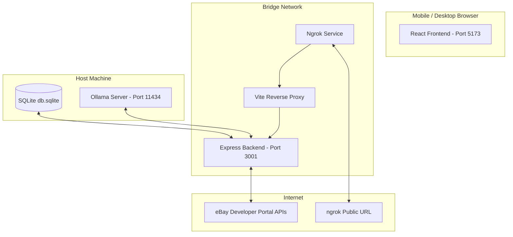

# MarketMaven (smart resell assistant)

MarketMaven is a progressive web application designed to optimize and automate the reselling workflow. It features a mobile-friendly progressive image-capture flow, local vision-based AI parsing, a SQLite draft manager queue, and a direct publisher integration to eBay.

Designed with a premium **Cozy Dark Botanical** theme (Sage Green and Terracotta accent details), it supports remote access (e.g., at thrift stores) using automated Docker-tunneling via ngrok.

---

## 🏗️ Architecture Overview

The application runs in a multi-container Docker network:



* **Frontend**: React, TypeScript, Tailwind CSS, Lucide icons, Framer Motion animations. Built and run via Vite.
* **Backend**: Node.js, Express, Multer (multipart file handling), SQLite3 (native DB integration).
* **Database**: Local SQLite database (`db.sqlite` mapped on the host machine).
* **Tunnel**: Dockerized `ngrok` instance exposed to port `5173`. Proxies `/api` and `/uploads` routes to the backend automatically under a single remote domain.
* **AI Model**: Local visual intelligence powered by Ollama running the **`qwen2.5vl`** vision-language model.

---

## ✨ Core Features

1. **Mobile Capture Hub (`/mobile`)**: A dedicated phone interface designed to scan items quickly at thrift stores. Uses a **progressive capture pipeline**:
   * Snap the **Big Three** critical photos (Cover, Size Tag, Ruler/Measurements) $\rightarrow$ start backend AI parsing immediately.
   * While the AI is reasoning in the background (60-90s), snap up to 7 optional detail photos (pockets, material tags, fabric details).
   * Once AI is done, upload detail photos to finish the draft.
2. **Dashboard Manager**: Review local drafts, edit draft details directly in the expanded drawer, import optional aspects/details from eBay sold comps using any eBay Item ID, copy templates, or publish straight to eBay.
3. **Unified Live Inventory**: Management table that merges modern Inventory API listings and traditional/legacy eBay listings, with support for ending listings directly from the app.
4. **Wife's Feedback Box**: An inline SQLite-backed suggestions queue on the dashboard that lets your wife send emoticons and text feedback. The admin dashboard lets you read, resolve, or delete feedback.
5. **Interactive Settings**: On-the-fly toggling between **Cozy Dark** / **Bright Linen** (light mode) themes, and **Sandbox** / **Production** eBay environments (reloads credentials automatically).
6. **Saturday Scheduling**: Automatically calculates and schedules draft publishing for the upcoming Saturday at 9:00 AM, publishing them directly as Scheduled listings in eBay Seller Hub.
7. **Bulk Edit & AI Listing Repair**: Select multiple active or traditional listings from the inventory manager to perform batch updates:
   * **Manual Bulk Edit**: Apply a single field value (like Country of Origin, Brand, or Quantity) to all selected listings at once.
   * **AI Auto-Repair**: Scans listing descriptions using local AI to automatically identify and extract missing specifics (like Material, Rise, Pattern, Fit, and Closure) and publishes them directly to active eBay listings in one click.

---

## 🛠️ Requirements & Prerequisites

To run this application locally, you will need:

1. **Docker & Docker Compose** installed.
2. **Ollama** installed on your host machine.
   * Verify Ollama is running and download the vision model:
     ```bash
     ollama pull qwen2.5vl
     ```
3. **ngrok Account** (for remote/mobile access).
   * Get an authtoken from the [ngrok dashboard](https://dashboard.ngrok.com/).
4. **eBay Developer Account** credentials.
   * Register keysets at the [eBay Developer Portal](https://developer.ebay.com/) for Sandbox and/or Production.

---

## 🚀 Setting Up & Local Installation

### 1. Configure Environments
Clone the repository and set up your local environment files:

#### Root `.env` (Tunnels Configuration)
Create a `.env` file at the root of the project:
```bash
cp .env.template .env
```
Open the file and add your ngrok token:
```env
NGROK_AUTHTOKEN=your_personal_ngrok_authtoken
```

#### Backend `.env` (API Credentials)
Create a `.env` file in the `backend/` directory:
```bash
cd backend
cp .env.template .env
```
Fill out the variables in `backend/.env`:
```env
PORT=3001
DATABASE_URL=db.sqlite
OLLAMA_URL=http://host.docker.internal:11434  # Enables Docker to talk to host's Ollama
VISION_MODEL=qwen2.5vl

# Sandbox credentials
EBAY_CLIENT_ID=your_sandbox_client_id
EBAY_CLIENT_SECRET=your_sandbox_client_secret
EBAY_REDIRECT_URI=your_sandbox_redirect_ruName
EBAY_DEV_ID=your_dev_id

# Production credentials
EBAY_PROD_CLIENT_ID=your_prod_client_id
EBAY_PROD_CLIENT_SECRET=your_prod_client_secret
EBAY_PROD_REDIRECT_URI=your_prod_redirect_ruName

# GitHub integration (Optional)
# Automatic issue generator for Wife's Feedback Box (needs 'repo' scope token)
GITHUB_TOKEN=your_github_personal_access_token_here
```

### 2. Start the Application
Run Docker Compose in the root directory to spin up the frontend, backend, and ngrok tunnel services:

```powershell
docker compose up --build -d
```

### 3. Retrieve the Remote Mobile Link
If you want to use the Mobile Capture Hub on a phone:
1. Open your browser and navigate to `http://localhost:4040` (the ngrok local status dashboard).
2. Copy the active public URL (ends in `.ngrok-free.app` or `.ngrok-free.dev`).
3. Scan or send that link to your phone! You can navigate to `/mobile` on your phone to start snapping photos at the store.

---

## 💾 Database Schema

The SQLite database (`db.sqlite`) contains three active tables:

### `items` (Local drafts queue)
* `id` (INTEGER, Primary Key)
* `title` (TEXT)
* `brand` (TEXT)
* `size` (TEXT)
* `weight` (TEXT)
* `inventory_code` (TEXT)
* `category` (TEXT)
* `status` (TEXT DEFAULT 'draft')
* `images` (TEXT) - Comma-separated paths of cropped files.
* `condition` (TEXT)
* `material` (TEXT)
* `measurements_note` (TEXT)
* `style_details` (TEXT)
* `country_of_origin` (TEXT)
* `age` (TEXT)
* `retail_price` (TEXT)
* `etsy_tags` (TEXT)
* `created_at` (DATETIME)

### `settings` (Dynamic runtime settings)
* `id` (INTEGER, Primary Key)
* `key` (TEXT UNIQUE)
* `value` (TEXT)

### `feedback` (Suggestions box)
* `id` (INTEGER, Primary Key)
* `message` (TEXT)
* `rating` (INTEGER) - 1 to 5 mapping to emojis.
* `status` (TEXT DEFAULT 'pending') - 'pending' or 'resolved'.
* `created_at` (DATETIME)

---

## 🛠️ Operations & Troubleshooting

* **Check Service Status**:
  ```powershell
  docker compose ps
  ```
* **View Logs**:
  ```powershell
  docker compose logs -f [backend|frontend|ngrok]
  ```
* **Recompile Frontend**:
  ```powershell
  docker compose exec frontend npm run build
  ```
* **WSL NTFS Watcher Polling**:
  If edits aren't hot-reloading on Windows hosts inside Docker, verify that `usePolling: true` is configured in `frontend/vite.config.ts`.
